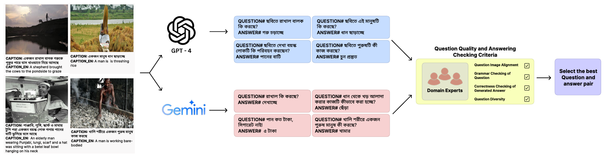
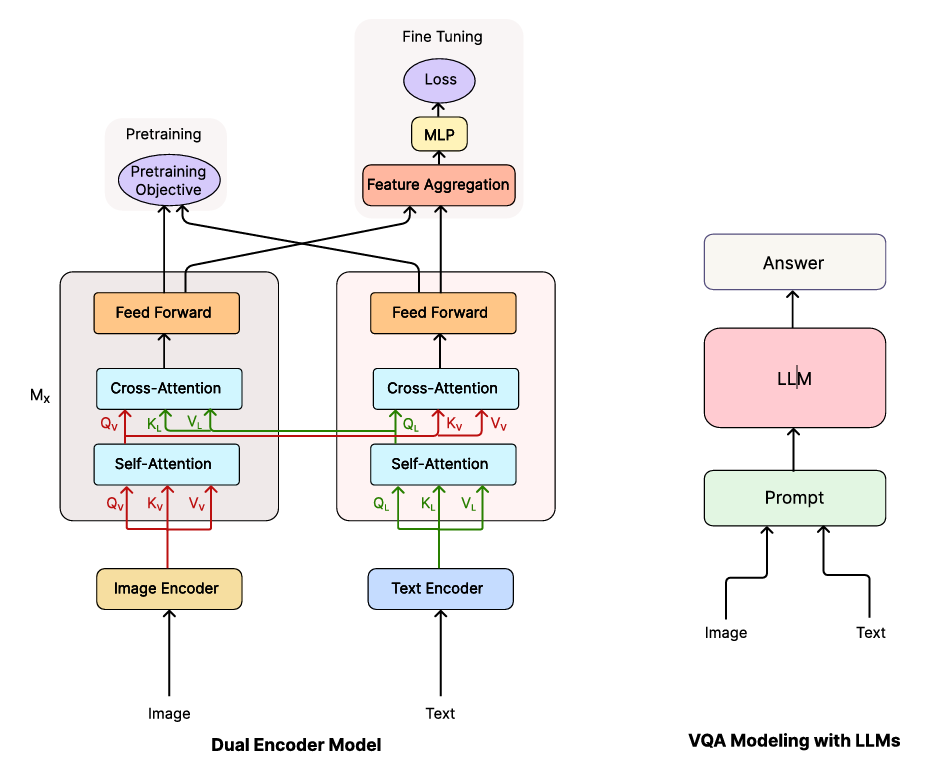

# ChitroJera: A Regionally Relevant Visual Question Answering Dataset for Bangla


[Md Fahim*](https://github.com/md-fahim/), 
[Deeparghya Dutta Barua*](https://github.com/arg274), 
[Md Sakib Ul Rahman Sourove*](https://github.com/souroveskb), 
[Md Farhan Ishmam](https://farhanishmam.github.io/), 
[Fariha Tanjim Shifat](https://github.com/fariha6412), 
[Fabiha Haider](https://github.com/FabihaHaider), and 
[Farhad Alam Bhuiyan](https://github.com/pdfarhad).

---

ChitroJera is a Bangla regionally relevant Visual Question Answering (VQA) dataset with over 15k samples that captures the cultural connotations associated with the Bengal region. We also establish novel baselines using multimodal pre-trained models and Large Language Models (LLMs).

## Data Format

Column Title | Description
------------ | -------------
`image_id` | The unique identifier of the image
`category` | Category of the image
`caption` | Bangla caption of the image
`caption_en` | English caption of the image
`question` | Question on the image in Bangla
`question_en` | Question on the image in English
`answer` | Answer to the question in Bangla
`answer_en` | Answer to the question in English

## Data Creation Pipeline



The images of the ChitroJera dataset are sourced from the `BanglaLekhaCaptions`, `Bornon`, and `BNature` datasets. We establish an automated question-answer generation pipeline using the LLMs GPT-4 and Gemini. The quality of the QA pairs is checked by domain experts based on four evaluation criteria. A few images and QA pairs have been provided in the `sample_dataset` folder.

## QA Statistics

| Q&A Statistics          | Q    | A    |
|-------------------------|------|------|
| Mean character length | 33.50 | 7.10 |
| Max character length  | 105  | 45   |
| Min character length  | 11   | 1    |
| Mean word count       | 5.86 | 1.43 |
| Max word count        | 17   | 8    |
| Min word count        | 3    | 1    |


## Methodology Overview


The baselines follow a dual-encoder model architecture. The encoders are individually pre-trained and the combined network with the feature aggregator is fine-tuned on the VQA dataset. We perform simple zero-shot prompting using the LLMs.

## Quick Start

 **Pre-trained Multimodal Model** [](https://colab.research.google.com/drive/1f6hxAPwqqis9n3i-RFB8ff5mwq_kPk-h?usp=sharing)

## Installation

We recommend using a virtual environment. Install the dependencies of this repository using:

```
pip install -r requirements.txt
```

## Training and Evaluation

To train and evaluate the model on VQA, use the following command:

```
python main.py
```
